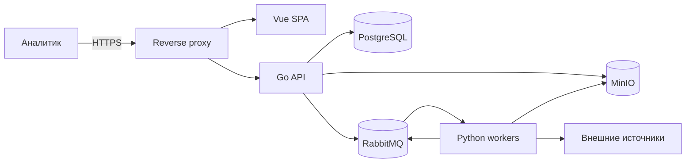
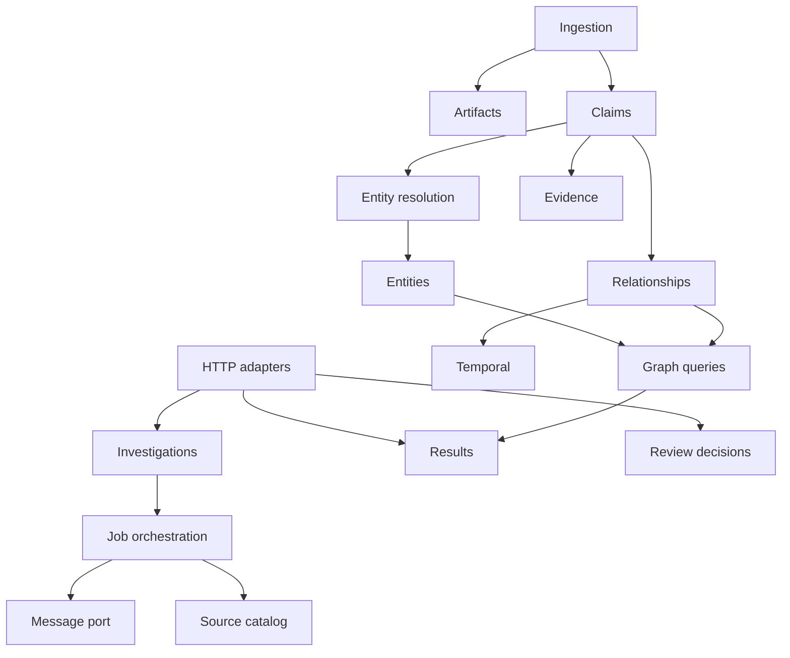

# Архитектура системы

## 1. Контекст

Пользователь взаимодействует только с Web и Go API. Воркеры не доступны из публичной сети и не записывают данные в PostgreSQL. PostgreSQL хранит состояние и структурированные данные, MinIO — исходные материалы, RabbitMQ — выполняемые команды и уведомления о результате.

## 2. Границы ответственности

### Vue SPA

- принимает исходные данные расследования;
- показывает прогресс по источникам;
- запрашивает выбор неоднозначного кандидата;
- показывает карточки, компактный граф, временную шкалу и доказательства;
- не рассчитывает итоговое сходство и не интерпретирует источник самостоятельно.

### Go API

- валидирует пользовательские команды;
- создаёт расследование и план источников;
- публикует задания;
- принимает стандартизированные результаты воркеров;
- управляет каноническими сущностями, отношениями и пользовательскими решениями;
- запускает нормализацию, entity resolution и формальные правила связей;
- формирует DTO интерфейса;
- является единственной публичной серверной точкой входа.

### Python workers

- реализуют способы доступа к источникам;
- соблюдают ограничения частоты и условия повторов;
- сохраняют исходные материалы;
- извлекают записи из JSON, CSV, HTML, PDF и других форматов;
- преобразуют записи в общий контракт;
- не принимают окончательное решение о тождестве сущностей;
- не формируют неподтверждённые отношения как факты.

Python-пакет может запускаться несколькими процессами из одного образа: `source-worker`, `document-worker`, `browser-worker`. FastAPI добавляется только для обоснованного синхронного внутреннего API или диагностики; потребление RabbitMQ не требует HTTP-сервера.

### PostgreSQL

- хранит состояние расследований и заданий;
- хранит ссылки и метаданные артефактов;
- хранит исходные записи, утверждения, сущности, связи и решения;
- обеспечивает транзакционные ограничения и поиск кандидатов через `pg_trgm`.

### MinIO

- хранит неизменяемый оригинал ответа или документа;
- хранит производные тексты, если их повторное получение дорого;
- не является базой предметных сущностей.

### RabbitMQ

- развязывает планирование и выполнение работы;
- распределяет задания между экземплярами воркеров;
- обеспечивает повторную доставку и изоляцию необрабатываемых сообщений;
- не используется как долговременное хранилище результата.

## 3. Модули Go API

Модули общаются через прикладные интерфейсы и предметные типы. HTTP, PostgreSQL, RabbitMQ и MinIO являются адаптерами. Импорт внутренних пакетов не должен создавать циклы.

## 4. Синхронные взаимодействия

REST используется для операций, где пользователь ожидает немедленный ответ:

- создать расследование;
- получить состояние;
- получить кандидатов;
- подтвердить или отклонить совпадение;
- получить граф, временную шкалу и доказательство;
- запросить расширение ветви.

Длительное получение источников не выполняется внутри HTTP-запроса. API отвечает идентификатором расследования и текущим состоянием.

## 5. Асинхронные взаимодействия

RabbitMQ используется для:

- запроса получения данных источника;
- запроса разбора документа;
- публикации результата адаптера;
- публикации окончательной ошибки задания;
- запуска повторной обработки сохранённого артефакта.

Сообщение уведомляет о работе или результате, а устойчивое состояние сохраняется в PostgreSQL/MinIO. В сообщении допускается ссылка на крупный объект, но не сам PDF или Bulk-файл.

## 6. Состояние и согласованность

- Изменение канонических данных выполняется транзакцией PostgreSQL.
- Публикация сообщения, зависящего от транзакции, выполняется через transactional outbox.
- Входящее сообщение регистрируется по `message_id`; повтор не создаёт второй результат.
- Между компонентами допускается eventual consistency.
- Интерфейс показывает промежуточное состояние и частичный результат.

## 7. Расширение после MVP

Архитектура допускает без изменения предметных контрактов:

- добавление регистрации и ролей;
- выделение document service;
- добавление OCR/LLM extraction;
- отдельные пулы browser workers;
- переход от polling к SSE;
- создание проекции в Neo4j или поисковом индексе;
- горизонтальное масштабирование consumers;
- добавление публичного SSR-интерфейса через Nuxt.

Эти возможности не реализуются заранее.
