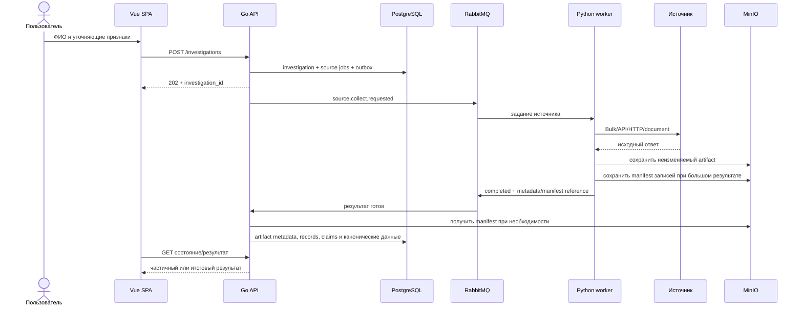

# Поток и состояния данных

## 1. Сквозной сценарий MVP



В MVP воркеры не подключаются к PostgreSQL. Небольшие стандартизированные результаты передаются сообщением, а крупные пакеты сохраняются в MinIO как manifest с передачей ссылки и hash. Go ingestion consumer проверяет контракт и записывает metadata, source records и claims. Это сохраняет одну точку владения схемой БД и не даёт адаптерам записывать канонические `entities` и `relationships`.

## 2. Этапы обработки

| Этап | Вход | Выход | Владелец |
|---|---|---|---|
| Планирование | параметры расследования | список `source_jobs` | Go API |
| Получение | задание источника | `artifact` | Python adapter |
| Разбор | artifact | `source_records` | Python parser |
| Отображение | source record | атомарные `claims` | Python mapper / Go validator |
| Нормализация | исходные значения | нормализованные значения и варианты | аналитическое ядро |
| Генерация кандидатов | claims + существующие entities | `match_candidates` | Go core + PostgreSQL |
| Решение | признаки кандидата | match decision | правила / пользователь |
| Материализация | подтверждённые claims | entities, relationships, events | Go core |
| Представление | канонические данные | graph/timeline/evidence DTO | Go API |

## 3. Состояния расследования

```text
created
  → running
  → waiting_for_review   # при наличии блокирующего выбора
  → completed            # все обязательные задания завершены или имеют явный исход
  → completed_partial    # часть источников недоступна, полезный результат сохранён
  → failed               # контур не дал пригодного результата из-за системной ошибки
  → cancelled
```

Расследование не переходит в `failed` только из-за недоступности одного источника.

## 4. Состояния задания источника

```text
pending → queued → running → succeeded
                    │
                    ├→ retry_wait → queued
                    ├→ action_required
                    ├→ unavailable
                    ├→ failed
                    └→ cancelled
```

- `action_required` — CAPTCHA, необходимость пользовательского выбора или ручного документа;
- `unavailable` — источник недоступен либо запрещает выбранный способ доступа;
- `failed` — исчерпаны технические повторы;
- `succeeded` — результат может быть пустым; отсутствие совпадений не является ошибкой.

## 5. Порядок данных

Обработка выполняется по следующему приоритету:

1. точные идентификаторы и выбранный пользователем кандидат;
2. первичные или официальные источники по данному утверждению;
3. структурированные наборы с происхождением;
4. документы и раскрытия;
5. обычные веб-страницы;
6. поисковые провайдеры только для обнаружения материала.

Порядок не означает, что более поздний источник перезаписывается более ранним. Конфликтующие утверждения сохраняются одновременно и оцениваются по типу утверждения, периоду, первичности и качеству доказательства.

## 6. Повторная обработка

Artifact и SourceRecord отделены от канонического результата, поэтому система может:

- повторно разобрать документ новой версией parser;
- заново выполнить нормализацию;
- пересчитать кандидатов после изменения правил;
- перестроить связи без повторного обращения к источнику.

Каждый производный объект хранит версию parser/mapping/rule, с помощью которой он был получен.

## 7. Выдача интерфейсу

Go API формирует отдельные read-модели:

- сводка расследования;
- состояния источников;
- очередь решений пользователя;
- карточка сущности;
- компактный граф;
- временная шкала;
- карточка связи;
- доказательства и конфликты.

MVP может использовать polling с интервалом 2–5 секунд. SSE добавляется после стабилизации API, если polling создаёт заметную задержку или нагрузку.
