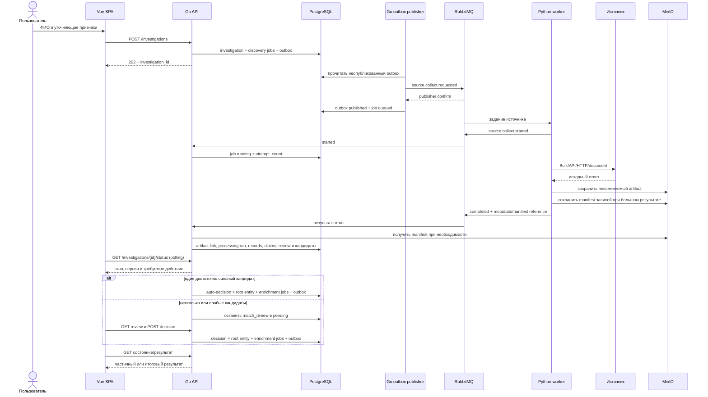

# Поток и состояния данных

## 1. Сквозной сценарий MVP


```mermaid
sequenceDiagram
    actor User as Пользователь
    participant Web as Vue SPA
    participant API as Go API
    participant DB as PostgreSQL
    participant PUB as Go outbox publisher
    participant MQ as RabbitMQ
    participant W as Python worker
    participant S as Источник
    participant O as MinIO

    User->>Web: ФИО и уточняющие признаки
    Web->>API: POST /investigations
    API->>DB: investigation + discovery jobs + outbox
    API-->>Web: 202 + investigation_id
    PUB->>DB: прочитать неопубликованный outbox
    PUB->>MQ: source.collect.requested
    MQ-->>PUB: publisher confirm
    PUB->>DB: outbox published + job queued
    MQ->>W: задание источника
    W->>MQ: source.collect.started
    MQ->>API: started
    API->>DB: job running + attempt_count
    W->>S: Bulk/API/HTTP/document
    S-->>W: исходный ответ
    W->>O: сохранить неизменяемый artifact
    W->>O: сохранить manifest записей при большом результате
    W->>MQ: completed + metadata/manifest reference
    MQ->>API: результат готов
    API->>O: получить manifest при необходимости
    API->>DB: artifact link, processing run, records, claims, review и кандидаты
    Web->>API: GET /investigations/{id}/status (polling)
    API-->>Web: этап, версия и требуемое действие
    alt один достаточно сильный кандидат
        API->>DB: auto-decision + root entity + enrichment jobs + outbox
    else несколько или слабые кандидаты
        API->>DB: оставить match_review в pending
        Web->>API: GET review и POST decision
        API->>DB: decision + root entity + enrichment jobs + outbox
    end
    Web->>API: GET состояние/результат
    API-->>Web: частичный или итоговый результат
```

В MVP воркеры не подключаются к PostgreSQL. Небольшие стандартизированные результаты передаются сообщением, а крупные пакеты сохраняются в MinIO как manifest с передачей ссылки и hash. Go ingestion consumer проверяет контракт и записывает metadata, source records и claims. Это сохраняет одну точку владения схемой БД и не даёт адаптерам записывать канонические `entities` и `relationships`.

RabbitMQ не вытягивает запрос из `source_jobs`. Команда уже содержит `job_id`, источник, операцию, параметры и лимиты. Таблица хранит долговременный снимок и состояние, а outbox является единственным мостом публикации из транзакции PostgreSQL в RabbitMQ.

## 2. Этапы обработки

| Этап | Вход | Выход | Владелец |
|---|---|---|---|
| Планирование discovery | параметры расследования | `source_jobs` с purpose `candidate_discovery` | Go API |
| Получение | задание источника | immutable `artifact` + job link | Python adapter / Go validator |
| Запуск обработки | artifact + версии parser/mapper | `processing_run` | Python runtime / Go ingestion |
| Разбор | processing run | `source_records` | Python parser |
| Отображение | source record | атомарные `claims` | Python mapper / Go validator |
| Нормализация | исходные значения | нормализованные значения и варианты | аналитическое ядро |
| Генерация кандидатов | entity-bearing source records + существующие entities | `match_candidates` | Go core + PostgreSQL |
| Проверка набора | признаки кандидатов | `match_review` | Go core |
| Решение | актуальная версия review | `match_decision` | правила / пользователь |
| Сопоставление | match decision | `entity_records` mapping | Go core |
| Планирование enrichment | подтверждённая корневая сущность | `source_jobs` с purpose `enrichment` | Go API |
| Материализация | claims актуальных runs и активных record mappings | пересобираемые entities и фактические relationships | Go core |
| Представление | канонические данные | graph/timeline/evidence DTO | Go API |

## 3. Состояния расследования

```text
created
  → running
  → completed            # все обязательные задания завершены или имеют явный исход
  → completed_partial    # часть источников недоступна, полезный результат сохранён
  → failed               # контур не дал пригодного результата из-за системной ошибки
  → cancelled
```

Расследование не переходит в `failed` только из-за недоступности одного источника.

`status` описывает общий жизненный цикл, а `stage` - текущую предметную фазу:

```text
subject_discovery → subject_resolution → enrichment → analysis → completed
```

- `subject_discovery` - быстрый поиск возможных исходных контрагентов;
- `subject_resolution` - автоматическое разрешение либо ожидание выбора пользователя;
- `enrichment` - полный сбор данных только по подтверждённому контрагенту;
- `analysis` - материализация связей, временных границ и read-моделей;
- `completed` - конечная фаза для `completed` или `completed_partial`.

Ожидание пользовательского решения не является отдельным взаимоисключающим `status`: расследование остаётся `running`, получает `stage = subject_resolution` и положительный `pending_review_count`. API на этом основании возвращает `requires_action = true`. Другие независимые задания могут завершаться, но enrichment исходного субъекта не начинается до решения.

## 4. Шлюз между discovery и enrichment

1. `POST /investigations` запускает только задания `candidate_discovery`.
2. Go core ждёт завершения обязательных discovery-источников, истечения ограниченного тайм-аута либо точного идентификатора без конфликта.
3. Единственный кандидат не выбирается автоматически только по количеству. Автовыбор допускается лишь по заранее проверенному сильному правилу.
4. Актуальный набор кандидатов всегда фиксируется как `match_review`: сильное правило сразу закрывает его автоматическим decision, а неоднозначный набор остаётся `pending`.
5. Если кандидатов нет, расследование завершается корректной пустой выдачей; это не системная ошибка и не требует пустого review.
6. Принятие решения одной транзакцией фиксирует decision, создаёт или выбирает корневую entity, закрывает review, меняет stage и создаёт enrichment jobs вместе с outbox.
7. Отдельный HTTP-запрос «продолжить расследование» не требуется: успешное решение само продолжает процесс.

Результаты discovery сохраняются и повторно используются. Enrichment не должен заново получать уже имеющийся неизменяемый artifact без причины.

## 5. Состояния задания источника

```text
pending → queued → running → succeeded | not_found
                    │
                    ├→ retry_wait → running
                    ├→ action_required
                    ├→ unavailable
                    ├→ failed
                    └→ cancelled
```

- `action_required` - CAPTCHA либо необходимость вручную предоставить документ; выбор кандидата хранится отдельно как `match_review` и не меняет статус задания источника;
- `unavailable` - источник недоступен либо запрещает выбранный способ доступа;
- `failed` - исчерпаны технические повторы;
- `succeeded` - получен и обработан непустой технический результат;
- `not_found` - источник корректно ответил, но подходящих записей нет; это не ошибка.

## 6. Порядок данных

Обработка выполняется по следующему приоритету:

1. точные идентификаторы и выбранный пользователем кандидат;
2. первичные или официальные источники по данному утверждению;
3. структурированные наборы с происхождением;
4. документы и раскрытия;
5. обычные веб-страницы;
6. поисковые провайдеры только для обнаружения материала.

Порядок не означает, что более поздний источник перезаписывается более ранним. Конфликтующие утверждения сохраняются одновременно и оцениваются по типу утверждения, периоду, первичности и качеству доказательства.

## 7. Повторная обработка

Artifact и processing run отделены от канонического результата, поэтому система может:

- повторно разобрать документ новой версией parser;
- заново выполнить нормализацию;
- пересчитать кандидатов после изменения правил;
- перестроить связи без повторного обращения к источнику.

Каждый производный объект хранит версию parser/mapping/rule, с помощью которой он был получен.

Повторная обработка создаёт новый `processing_run`; records и claims прежнего run не изменяются. Новый run становится актуальным только после успешной полной валидации. Затем Go пересобирает затронутые канонические проекции из claims актуальных runs и активных `entity_records`. Неудачный run не скрывает последнюю успешную версию.

Отмена match decision закрывает соответствующий mapping через `unlinked_at` и запускает тот же ограниченный пересчёт. Имена, идентификаторы или отношения, потерявшие все допустимые основания, исключаются из текущей read-модели; исходные claims и artifacts остаются в истории.

## 8. Запоздалые и повторные worker events

- `message_id` дедуплицирует одну публикацию, а `job_id + result_digest` - один бизнес-результат, даже если повтор команды создал новое сообщение.
- `attempt_no` задаёт порядок попыток. Запоздалые `started` и `retry_scheduled` не понижают terminal status.
- Результат отменённого расследования может зарегистрировать artifact и технический receipt, но получает `applied = false`, не создаёт новые mappings/relationships и не меняет investigation status.
- Inbox, запись принятого результата, полезный эффект и увеличение `state_version` выполняются одной PostgreSQL-транзакцией.

## 9. Выдача интерфейсу

Go API формирует отдельные read-модели:

- сводка расследования;
- состояния источников;
- очередь решений пользователя;
- карточка сущности;
- компактный граф;
- временная шкала;
- карточка связи;
- доказательства и конфликты.

В MVP интерфейс использует polling `GET /investigations/{id}/status` раз в 2–3 секунды. Endpoint читает компактное сохранённое состояние расследования одним индексированным запросом и не обращается к RabbitMQ, воркерам и внешним источникам. Polling останавливается в конечном состоянии, замедляется в скрытой вкладке и использует jitter/backoff при ошибках.

В `investigations` сразу хранится монотонная `state_version`. Она позволяет позднее без изменения предметной модели добавить условные запросы `ETag`/`If-None-Match` и SSE. SSE служит только уведомлением об изменении версии: после события клиент получает актуальную read-модель обычным HTTP. WebSocket и webhook для обновления браузера в MVP не применяются.
