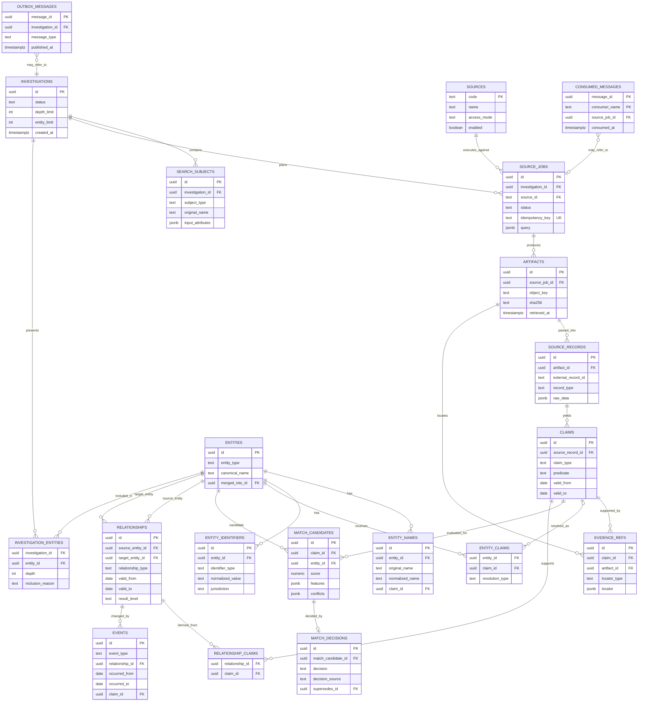

# Модель данных и ERD

## 1. Принципы

- PostgreSQL является источником истины для структурированных данных.
- UUID используются как внутренние идентификаторы; внешние идентификаторы хранятся отдельно вместе с юрисдикцией и источником.
- Исходные и нормализованные значения не заменяют друг друга.
- Источник не создаёт каноническую сущность напрямую.
- Утверждение и доказательство существуют независимо от решения о тождестве.
- Факт, вычисленная связь и гипотеза имеют явный уровень.
- Неизвестная дата представляется отсутствием значения и точностью `unknown`, а не выдуманным интервалом.
- Крупные бинарные данные находятся в MinIO; PostgreSQL хранит ключ, hash и метаданные.

## 2. ERD MVP



Обозначения: `PK` — первичный ключ, `FK` — внешний ключ, `UK` — уникальное ограничение. Диаграмма показывает таблицы, основные поля и логические отношения, но не заменяет SQL-миграции. Точный тип частично известных дат может быть уточнён при написании первой миграции.

## 3. Словарь таблиц и инварианты

Диаграмма показывает структуру, а этот раздел фиксирует смысл полей, владельца записи и ограничения, которые невозможно однозначно выразить линиями ERD.

### Расследование

**`investigations`**

- `id uuid`;
- `status`;
- `depth_limit`;
- `entity_limit`;
- `created_at`, `started_at`, `completed_at`;
- `failure_code`, `failure_detail`.

**`search_subjects`**

- `id`, `investigation_id`;
- `subject_type` (`person`, `organization`);
- исходные ФИО/название;
- уточнения в `input_attributes jsonb`;
- `normalized_query jsonb`;
- `created_at`.

На MVP расследование обычно имеет один начальный субъект, однако модель допускает повторный запуск или несколько субъектов позднее.

### Каталог и задания источников

**`sources`**

- стабильный `id`/`code`;
- название, jurisdiction;
- способ доступа;
- статус включения;
- приоритет и ограничения;
- конфигурация без секретов.

**`source_jobs`**

- `id`, `investigation_id`, `source_id`;
- `parent_job_id` для расширения;
- `job_type`, `status`, `priority`;
- `query jsonb`;
- `idempotency_key` с unique constraint;
- `attempt`, `max_attempts`;
- временные метки;
- `error_code`, `error_detail`.

RabbitMQ не заменяет `source_jobs`: очередь доставляет работу, таблица отражает долговременное состояние для пользователя и аудита.

### Происхождение

**`artifacts`**

- `id`, `source_job_id`, `source_id`;
- `kind`, `media_type`;
- `source_uri`, `external_id`;
- `object_key`;
- `sha256`, `byte_size`;
- `retrieved_at`, `published_at`;
- `http_metadata jsonb`;
- `parser_version`.

Комбинация источника, внешнего идентификатора/hash и версии получения защищает от случайного дублирования. Объект MinIO после регистрации не перезаписывается.

**`source_records`**

- `id`, `artifact_id`, `source_id`;
- `external_record_id`;
- `record_type`;
- `raw_data jsonb` или ссылка на крупную запись;
- `schema_version`, `parser_version`;
- `parsed_at`.

**`claims`**

- `id`, `source_record_id`;
- `claim_type`;
- `subject_ref`, `predicate`, `object_value`/`object_ref`;
- `raw_value`, `normalized_value`;
- `valid_from`, `valid_to`, `date_precision`, `date_basis`;
- `confidence_kind` — не численная вероятность, а происхождение оценки;
- `mapping_version`, `created_at`.

**`evidence_refs`**

- `id`, `claim_id`, `artifact_id`;
- `locator_type` (`json_pointer`, `page`, `text_quote`, `row`, `html_selector`);
- `locator jsonb`;
- короткий допустимый `excerpt`;
- `created_at`.

### Канонические данные

**`entities`**

- `id`, `entity_type`;
- `canonical_name`;
- `status`;
- `created_at`, `updated_at`;
- `merged_into_id` для обратимого объединения.

**`entity_names`**

- `entity_id`;
- исходное и нормализованное имя;
- script/language;
- тип варианта;
- ссылка на claim;
- признак предпочтительного имени.

**`entity_identifiers`**

- `entity_id`;
- `identifier_type`, `value`, `normalized_value`;
- `jurisdiction`, `issuer`;
- ссылка на claim;
- ограничение уникальности применяется только там, где идентификатор гарантированно уникален в области.

**`entity_claims`** связывает claim с entity и хранит тип решения и его версию.

### Сопоставление

**`match_candidates`**

- `id`, `claim_id`, `entity_id`;
- `score`;
- `features jsonb`;
- `conflicts jsonb`;
- `algorithm_version`;
- `status`;
- `created_at`.

**`match_decisions`**

- `id`, `match_candidate_id`;
- `decision` (`accept`, `reject`, `defer`);
- `decision_source` (`rule`, `user`);
- `reason`;
- `decided_at`;
- `supersedes_id` для отмены решения.

### Связи и события

**`relationships`**

- `id`, `source_entity_id`, `target_entity_id`;
- `relationship_type`;
- роль, должность, доля и иные атрибуты в `attributes jsonb` с типизированными критичными полями;
- `valid_from`, `valid_to`;
- точность и основание обеих границ;
- `result_level` (`fact`, `derived`, `hypothesis`);
- `rule_version` для вычисленных связей;
- `status`.

**`relationship_claims`** связывает отношение с подтверждающими claims. Фактическое отношение должно иметь хотя бы один claim.

**`events`**

- `id`, `event_type`;
- субъект/отношение;
- `occurred_from`, `occurred_to`, `date_precision`;
- ссылка на claim;
- `created_at`.

### Представление расследования

**`investigation_entities`** хранит включение сущности в конкретную выдачу, глубину, причину включения и флаг скрытия из компактного результата. Каноническая сущность может участвовать в нескольких расследованиях после появления многопользовательского режима.

### Надёжная доставка

**`outbox_messages`** содержит сообщение, создаваемое в одной транзакции с изменением состояния. Publisher отправляет его в RabbitMQ и отмечает `published_at`.

**`consumed_messages`** содержит `message_id`, имя consumer и результат обработки. Уникальность пары предотвращает повторный эффект при повторной доставке.

## 4. Схемы PostgreSQL и права

Рекомендуемые логические схемы:

- `core` — расследования, сущности, claims, отношения;
- `ingest` — source records и staging, записываемые Go ingestion consumer;
- `integration` — outbox и consumed messages;
- `catalog` — источники и справочники.

Go API и его ingestion consumer имеют права на канонические и ingest-таблицы. Python workers работают через контракты сообщений и MinIO и не получают реквизиты PostgreSQL. Если будущие Bulk-объёмы потребуют иной схемы загрузки, она принимается отдельной ADR.

## 5. Индексы первой итерации

- B-tree по внешним идентификаторам, статусам и foreign keys;
- GIN/GiST trigram indexes по нормализованным именам;
- индекс `source_jobs(investigation_id, status)`;
- unique по `source_jobs.idempotency_key`;
- unique по consumer и `message_id`;
- индекс временных границ отношений;
- GIN по JSONB добавляется только под подтверждённый запрос.

### `pg_trgm`

Расширение создаётся первой SQL-миграцией:

```sql
CREATE EXTENSION IF NOT EXISTS pg_trgm;
```

Trigram indexes создаются прежде всего для `entity_names.normalized_name` и нормализованных названий организаций. Они используются для формирования ограниченного списка кандидатов, а не для автоматического объединения сущностей. Порог similarity и план запроса проверяются на golden dataset через `EXPLAIN (ANALYZE, BUFFERS)` до фиксации значений.

## 6. Удаление и история

На MVP используется логическое прекращение действия или `merged_into_id`, если физическое удаление разрушило бы происхождение. Исходные материалы имеют настраиваемый срок хранения. Политика удаления персональных данных уточняется до внешнего использования продукта.
