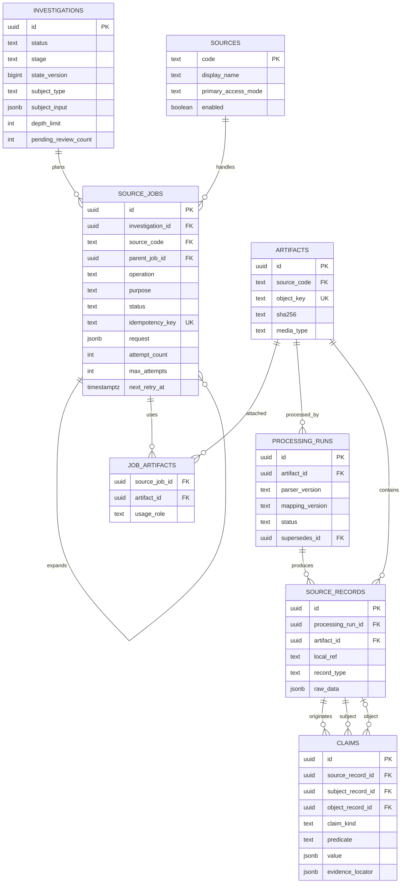
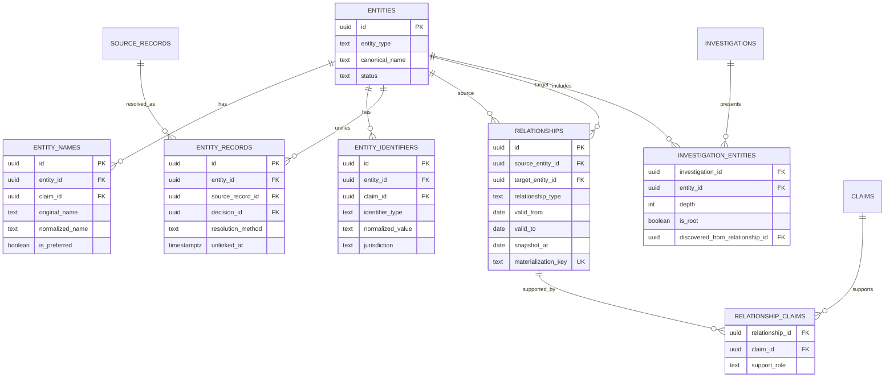
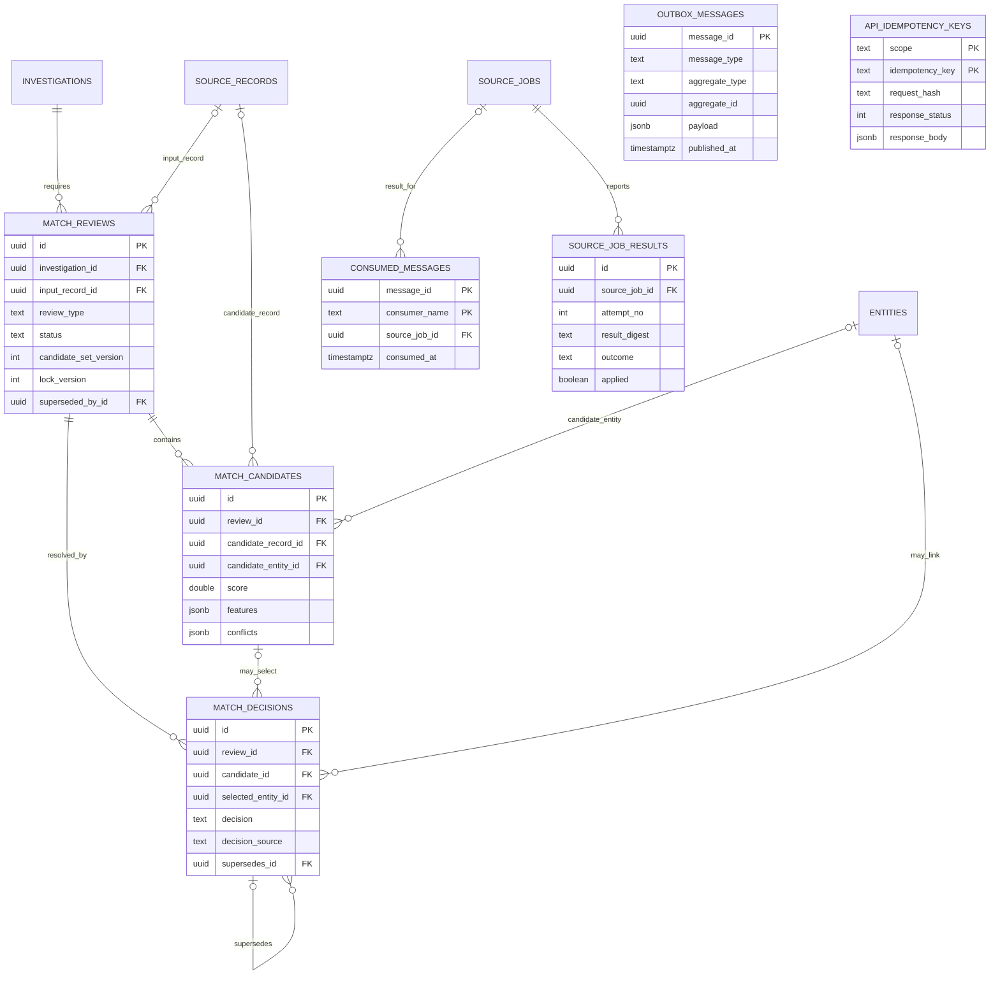

# Модель данных и ERD

## 1. Назначение и принципы

PostgreSQL хранит структурированную историю расследования: что запросил пользователь, какие источники обработаны, какие материалы получены, что утверждают эти материалы и к каким реальным людям или организациям отнесены записи.

```text
расследование → задание → исходный материал → запись источника
              → атомарное утверждение → сущность или фактическое отношение
```

Основные правила:

- RabbitMQ доставляет работу, MinIO хранит файлы, PostgreSQL является источником истины о состоянии и результате.
- Исходное значение не заменяется нормализованным.
- Python-адаптер не записывает в PostgreSQL и не создаёт канонические сущности.
- С сущностью сопоставляется запись/упоминание целиком, а не отдельный claim.
- Подтверждённые отношения хранятся отдельно от вычисленных связей и гипотез.
- Каждый отображаемый факт проводится до исходного материала.
- Неизвестная дата не достраивается.
- Повторная доставка RabbitMQ не должна создавать дубликаты.

## 2. Этапы развития схемы

### 2.1. Минимальный сквозной контур

```text
investigations           sources
source_jobs              artifacts
job_artifacts            processing_runs
source_records           claims
entities                 entity_names
entity_identifiers       entity_records
relationships            relationship_claims
investigation_entities   outbox_messages
consumed_messages        source_job_results
api_idempotency_keys
```

Этого достаточно, чтобы провести тестовую запись от запроса до факта с доказательством, безопасно повторить parser новой версии и не применить один worker-result дважды.

### 2.2. Сопоставление сущностей в MVP

Перед пользовательским подтверждением неоднозначных совпадений добавляются:

```text
match_reviews
match_candidates
match_decisions
```

### 2.3. Темпоральное расширение целевого MVP

`events` добавляется на этапе самостоятельной materialization событий после проверки event claims на реальном источнике, например KASE. Начальный KASE-срез может сохранить назначение/прекращение как claims и построить timeline из claims и временных границ relationships, не теряя возможность позднее материализовать events.

### 2.4. После MVP

Только при подтверждённой необходимости рассматриваются:

```text
derived_relationships    derivation_inputs
discovery_paths          source_snapshots/cache_entries
users                    organizations/tenants
roles                    saved_reports
audit_log
```

Таблицы `graph_nodes` и `graph_edges` не нужны: узлы - `entities`, рёбра - `relationships`; вычисляемый граф является DTO или поздней производной проекцией.

## 3. ERD MVP

### 3.1. Получение и происхождение


```mermaid
erDiagram
    INVESTIGATIONS {
        uuid id PK
        text status
        text stage
        bigint state_version
        text subject_type
        jsonb subject_input
        int depth_limit
        int pending_review_count
    }
    SOURCES {
        text code PK
        text display_name
        text primary_access_mode
        boolean enabled
    }
    SOURCE_JOBS {
        uuid id PK
        uuid investigation_id FK
        text source_code FK
        uuid parent_job_id FK
        text operation
        text purpose
        text status
        text idempotency_key UK
        jsonb request
        int attempt_count
        int max_attempts
        timestamptz next_retry_at
    }
    ARTIFACTS {
        uuid id PK
        text source_code FK
        text object_key UK
        text sha256
        text media_type
    }
    JOB_ARTIFACTS {
        uuid source_job_id FK
        uuid artifact_id FK
        text usage_role
    }
    PROCESSING_RUNS {
        uuid id PK
        uuid artifact_id FK
        text parser_version
        text mapping_version
        text status
        uuid supersedes_id FK
    }
    SOURCE_RECORDS {
        uuid id PK
        uuid processing_run_id FK
        uuid artifact_id FK
        text local_ref
        text record_type
        jsonb raw_data
    }
    CLAIMS {
        uuid id PK
        uuid source_record_id FK
        uuid subject_record_id FK
        uuid object_record_id FK
        text claim_kind
        text predicate
        jsonb value
        jsonb evidence_locator
    }
    INVESTIGATIONS ||--o{ SOURCE_JOBS : plans
    SOURCES ||--o{ SOURCE_JOBS : handles
    SOURCE_JOBS ||--o{ SOURCE_JOBS : expands
    SOURCE_JOBS ||--o{ JOB_ARTIFACTS : uses
    ARTIFACTS ||--o{ JOB_ARTIFACTS : attached
    ARTIFACTS ||--o{ PROCESSING_RUNS : processed_by
    PROCESSING_RUNS ||--o{ SOURCE_RECORDS : produces
    ARTIFACTS ||--o{ SOURCE_RECORDS : contains
    SOURCE_RECORDS ||--o{ CLAIMS : originates
    SOURCE_RECORDS ||--o{ CLAIMS : subject
    SOURCE_RECORDS o|--o{ CLAIMS : object
```

### 3.2. Сущности и фактические связи


```mermaid
erDiagram
    ENTITIES {
        uuid id PK
        text entity_type
        text canonical_name
        text status
    }
    ENTITY_NAMES {
        uuid id PK
        uuid entity_id FK
        uuid claim_id FK
        text original_name
        text normalized_name
        boolean is_preferred
    }
    ENTITY_IDENTIFIERS {
        uuid id PK
        uuid entity_id FK
        uuid claim_id FK
        text identifier_type
        text normalized_value
        text jurisdiction
    }
    ENTITY_RECORDS {
        uuid id PK
        uuid entity_id FK
        uuid source_record_id FK
        uuid decision_id FK
        text resolution_method
        timestamptz unlinked_at
    }
    RELATIONSHIPS {
        uuid id PK
        uuid source_entity_id FK
        uuid target_entity_id FK
        text relationship_type
        date valid_from
        date valid_to
        date snapshot_at
        text materialization_key UK
    }
    RELATIONSHIP_CLAIMS {
        uuid relationship_id FK
        uuid claim_id FK
        text support_role
    }
    INVESTIGATION_ENTITIES {
        uuid investigation_id FK
        uuid entity_id FK
        int depth
        boolean is_root
        uuid discovered_from_relationship_id FK
    }
    ENTITIES ||--o{ ENTITY_NAMES : has
    ENTITIES ||--o{ ENTITY_IDENTIFIERS : has
    ENTITIES ||--o{ ENTITY_RECORDS : unifies
    SOURCE_RECORDS ||--o{ ENTITY_RECORDS : resolved_as
    ENTITIES ||--o{ RELATIONSHIPS : source
    ENTITIES ||--o{ RELATIONSHIPS : target
    RELATIONSHIPS ||--o{ RELATIONSHIP_CLAIMS : supported_by
    CLAIMS ||--o{ RELATIONSHIP_CLAIMS : supports
    INVESTIGATIONS ||--o{ INVESTIGATION_ENTITIES : presents
    ENTITIES ||--o{ INVESTIGATION_ENTITIES : includes
```

### 3.3. Matching и надёжная доставка


```mermaid
erDiagram
    INVESTIGATIONS ||--o{ MATCH_REVIEWS : requires
    MATCH_REVIEWS ||--o{ MATCH_CANDIDATES : contains
    MATCH_REVIEWS ||--o{ MATCH_DECISIONS : resolved_by
    SOURCE_RECORDS o|--o{ MATCH_REVIEWS : input_record
    SOURCE_RECORDS o|--o{ MATCH_CANDIDATES : candidate_record
    ENTITIES o|--o{ MATCH_CANDIDATES : candidate_entity
    MATCH_CANDIDATES o|--o{ MATCH_DECISIONS : may_select
    ENTITIES o|--o{ MATCH_DECISIONS : may_link
    MATCH_DECISIONS o|--o{ MATCH_DECISIONS : supersedes
    SOURCE_JOBS o|--o{ CONSUMED_MESSAGES : result_for
    SOURCE_JOBS ||--o{ SOURCE_JOB_RESULTS : reports

    MATCH_REVIEWS {
        uuid id PK
        uuid investigation_id FK
        uuid input_record_id FK
        text review_type
        text status
        int candidate_set_version
        int lock_version
        uuid superseded_by_id FK
    }
    MATCH_CANDIDATES {
        uuid id PK
        uuid review_id FK
        uuid candidate_record_id FK
        uuid candidate_entity_id FK
        double score
        jsonb features
        jsonb conflicts
    }
    MATCH_DECISIONS {
        uuid id PK
        uuid review_id FK
        uuid candidate_id FK
        uuid selected_entity_id FK
        text decision
        text decision_source
        uuid supersedes_id FK
    }
    OUTBOX_MESSAGES {
        uuid message_id PK
        text message_type
        text aggregate_type
        uuid aggregate_id
        jsonb payload
        timestamptz published_at
    }
    CONSUMED_MESSAGES {
        uuid message_id PK
        text consumer_name PK
        uuid source_job_id FK
        timestamptz consumed_at
    }
    SOURCE_JOB_RESULTS {
        uuid id PK
        uuid source_job_id FK
        int attempt_no
        text result_digest
        text outcome
        boolean applied
    }
    API_IDEMPOTENCY_KEYS {
        text scope PK
        text idempotency_key PK
        text request_hash
        int response_status
        jsonb response_body
    }
```

`PK` - первичный ключ, `FK` - внешний, `UK` - уникальное ограничение. ERD показывает ключевые поля; точная семантика определяется ниже и реализуется SQL-миграциями.

## 4. Расследование и задания

### `investigations`

Одна строка - один запуск исследования.

| Поле | Назначение |
|---|---|
| `id uuid` | Идентификатор расследования |
| `status text` | `created`, `running`, `completed`, `completed_partial`, `failed`, `cancelled` |
| `stage text` | `subject_discovery`, `subject_resolution`, `enrichment`, `analysis`, `completed` |
| `state_version bigint` | Монотонная версия компактного состояния для polling, будущих ETag и SSE |
| `subject_type text` | `person` или `organization` |
| `subject_input jsonb` | Исходные ФИО/название и уточнения пользователя |
| `normalized_input jsonb` | Варианты порядка имени, транслитерации и нормализованные идентификаторы |
| `depth_limit integer` | Зафиксированная максимальная глубина расширения |
| `entity_limit integer` | Предел объектов основной выдачи |
| `pending_review_count integer` | Количество актуальных неоднозначных решений |
| `started_at`, `completed_at timestamptz` | Время выполнения |
| `failure_code`, `failure_detail text` | Причина системного провала всего расследования |
| `created_at`, `updated_at timestamptz` | Системные метки |

`status`, `stage` и необходимость действия не дублируют друг друга: первое описывает жизненный цикл, второе - фазу, а необходимость действия вычисляется как `pending_review_count > 0`. Счётчик меняется в одной транзакции с созданием или закрытием review. `state_version` увеличивается в той же транзакции при каждом видимом изменении статуса, этапа, прогресса или требуемого действия. Отдельная `search_subjects` появится только при нескольких исходных субъектах в одном расследовании.

### `sources`

Минимальный справочник адаптеров, заполняемый идемпотентной data-миграцией из `db/migrations`. Это обязательные данные приложения, поэтому они не зависят от необязательного запуска `db/seeds`.

| Поле | Назначение |
|---|---|
| `code text` | Стабильный код: `icij`, `opensanctions`, `kase` |
| `display_name text` | Название для UI |
| `primary_access_mode text` | Основной режим: `bulk`, `api`, `document`, `http`, `browser`; дополнительные возможности декларирует metadata адаптера |
| `enabled boolean` | Доступен ли источник планировщику |
| `display_order integer` | Порядок в интерфейсе |
| `created_at`, `updated_at` | Системные метки |

URL, capabilities, rate limits и секреты остаются в metadata/configuration адаптера. Паролей и API keys здесь нет. Источник планируется только когда он включён и в справочнике, и feature flag текущего окружения; переменная окружения может аварийно отключить интеграцию без миграции БД.

### `source_jobs`

Долговременное состояние работы, передаваемой через RabbitMQ.

| Поле | Назначение |
|---|---|
| `id uuid` | ID задания и часть каждого сообщения |
| `investigation_id uuid` | Родительское расследование |
| `source_code text` | Адаптер-исполнитель |
| `parent_job_id uuid` | Родитель при расширении или разборе дочернего документа |
| `operation text` | `search_person`, `fetch_record`, `fetch_document` и т. п. |
| `purpose text` | Зачем создано задание: `candidate_discovery`, `enrichment`, `branch_expansion`, `document_processing`, `reprocessing` |
| `status text` | `pending`, `queued`, `running`, `retry_wait`, `succeeded`, `not_found`, `action_required`, `unavailable`, `failed`, `cancelled` |
| `priority smallint` | Значение `0..100`; большее значение выполняется раньше |
| `request jsonb` | Версионированные параметры операции |
| `request_hash text` | Hash нормализованного запроса для диагностики и будущего кэша |
| `idempotency_key text` | Защита от повторного создания той же работы |
| `attempt_count integer` | Число фактически начатых worker-попыток |
| `max_attempts integer` | Зафиксированный для задания предел попыток |
| `next_retry_at timestamptz` | Информационное время следующей попытки; доставкой управляет RabbitMQ |
| `started_at`, `finished_at` | Время выполнения |
| `error_code`, `error_detail` | Последняя классифицированная ошибка |
| `created_at`, `updated_at` | Системные метки |

RabbitMQ не читает эту таблицу. Go API одной транзакцией создаёт `source_jobs` и `outbox_messages`; publisher читает outbox и отправляет самодостаточную команду в RabbitMQ. `request` хранится для аудита и воспроизводимости, а его снимок включается в payload outbox. После создания request не изменяется.

`priority`, `attempt_count`, `max_attempts` и `next_retry_at` описывают бизнес-состояние для API и диагностики. Реальную маршрутизацию, задержку и повторную доставку выполняет RabbitMQ. `idempotency_key` не является ключом кэша.

Каждое worker-событие содержит `attempt_no` и `attempt_id`. Go применяет переход только если попытка не старее уже учтённой. Терминальный статус не переводится обратно в `running` или `retry_wait` запоздавшим событием. `attempt_count` отражает максимальный принятый номер фактически начатой попытки, а не число полученных сообщений `started`.

Владельцем строк является Go-контур:

- API создаёт `pending`;
- outbox publisher после publisher confirm переводит в `queued`;
- событие worker `started` переводит в `running` и устанавливает `attempt_count = max(attempt_count, attempt_no)`;
- событие `retry_scheduled` устанавливает `retry_wait` и `next_retry_at`;
- итоговый event устанавливает `succeeded`, `not_found`, `action_required`, `unavailable` или `failed`.

## 5. Происхождение данных

### `artifacts`

Метаданные неизменяемого оригинала в MinIO: ответа API, HTML, CSV, PDF, архива или manifest.

| Поле | Назначение |
|---|---|
| `id uuid` | ID материала |
| `source_code text` | Источник происхождения независимо от расследования, которое первым получило материал |
| `kind text` | `api_response`, `html`, `pdf`, `csv`, `archive`, `manifest`, `derived_text` |
| `media_type text` | MIME type |
| `source_uri`, `external_id text` | URL и ID у источника, если доступны |
| `object_key text` | Уникальный путь объекта MinIO |
| `parent_artifact_id uuid` | Исходный artifact для производного текста/представления; nullable для оригинала |
| `sha256 text` | Контроль целостности и поиск одинакового содержимого |
| `byte_size bigint` | Размер |
| `published_at timestamptz` | Публикация источником |
| `retrieved_at timestamptz` | Получение GraphX |
| `http_metadata jsonb` | Безопасные status/headers |
| `adapter_version text` | Версия получателя |
| `created_at timestamptz` | Регистрация в БД |

Artifact не принадлежит одному job: сохранённый материал может повторно использоваться в другом расследовании или reprocessing. `sha256` не уникален, потому что одно содержание может быть законно получено разными способами или из разных URI. `object_key` никогда не перезаписывается другим содержимым; повторный PUT допустим только при совпадающем hash. Для локального учебного MVP это прикладной инвариант, а bucket versioning включается до загрузки реальных демонстрационных материалов.

### `job_artifacts`

Связывает задания и использованные либо созданные ими материалы.

| Поле | Назначение |
|---|---|
| `source_job_id`, `artifact_id uuid` | Составной первичный ключ |
| `usage_role text` | `produced`, `reused`, `input`, `manifest`, `derived` |
| `created_at timestamptz` | Время регистрации связи |

### `processing_runs`

Один запуск parser/mapper над неизменяемым artifact. Повторная обработка создаёт новый run и не изменяет результаты прежнего.

| Поле | Назначение |
|---|---|
| `id uuid` | ID запуска |
| `artifact_id uuid` | Обрабатываемый материал |
| `run_kind text` | `initial`, `reprocessing`, `document_derivation` |
| `processing_scope text` | Стабильная область обработки, например `source_records` или `pdf_text` |
| `schema_version integer` | Версия общего ingest-контракта |
| `parser_version`, `mapping_version text` | Версии преобразований |
| `status text` | `running`, `succeeded`, `failed`, `superseded` |
| `supersedes_id uuid` | Предыдущий run, который заменяется после успешного завершения |
| `started_at`, `completed_at timestamptz` | Временные метки |

Для одного artifact может существовать много исторических runs, но не более одного актуального успешного run для `(artifact_id, processing_scope)`. Новый run становится актуальным одной транзакцией: прежний `succeeded` переводится в `superseded`, а новый - в `succeeded` только после полной валидации его records и claims. Неудачный запуск не скрывает предыдущий результат.

### `source_records`

Логические записи/упоминания внутри artifact.

| Поле | Назначение |
|---|---|
| `id uuid` | Внутренняя ссылка на упоминание |
| `processing_run_id uuid` | Конкретный запуск parser/mapper |
| `artifact_id uuid` | Материал происхождения |
| `external_record_id text` | ID у источника, если есть |
| `local_ref text` | Стабильная ссылка внутри artifact/manifest |
| `record_type text` | `person`, `organization`, `address`, `relationship`, `event`, `unknown` |
| `raw_data jsonb` | Извлечённая запись до канонизации |
| `schema_version integer` | Версия общего SourceRecord |
| `parser_version text` | Версия parser |
| `parsed_at timestamptz` | Время разбора |

Уникальность: `(processing_run_id, local_ref)`. `artifact_id` хранится явно для простого provenance и обязан совпадать с artifact run; это проверяется ingestion transaction. Внешний ID не глобально уникален, поскольку запись может присутствовать в нескольких snapshot.

### `claims`

Минимальные проверяемые утверждения.

| Поле | Назначение |
|---|---|
| `id uuid` | ID утверждения |
| `source_record_id uuid` | Запись происхождения |
| `subject_record_id uuid` | О каком упоминании сделано утверждение |
| `claim_kind text` | `attribute`, `relationship`, `event` |
| `predicate text` | `name`, `identifier`, `holds_position`, `owns`, `appointed` и т. п. |
| `object_record_id uuid` | Второй объект relationship claim |
| `value jsonb` | Значение attribute claim |
| `qualifiers jsonb` | Роль, должность, доля и другие параметры |
| `raw_value`, `normalized_value jsonb` | Исходное и нормализованное значения |
| `valid_from`, `valid_to date` | Доказанные границы действия |
| `valid_from_precision`, `valid_to_precision text` | `day`, `month`, `year`, `approximate`, `unknown` |
| `valid_from_basis`, `valid_to_basis text` | `explicit`, `event_derived`, `snapshot`, `computed`, `unknown` |
| `snapshot_at date`, `snapshot_precision text` | Состояние, подтверждённое на дату без доказанного интервала |
| `evidence_locator jsonb` | JSON Pointer, страница PDF, строка CSV и т. п. |
| `evidence_excerpt text` | Короткий фрагмент для проверки |
| `extraction_method text` | `structured`, `parser`, `ocr`, `llm_assisted`, `manual` |
| `mapping_version text` | Версия mapper |
| `normalization_version text` | Версия нормализации производного значения |
| `created_at timestamptz` | Время сохранения |

Для `attribute` заполняется `value`, для `relationship` - `object_record_id`. Для `event` явно задаются `predicate`, subject и при необходимости object record, а дата находится в temporal fields/qualifiers; допустимые комбинации обеспечиваются отдельными `CHECK` по `claim_kind`. Locator находится в claim, поэтому `evidence_refs` в MVP не нужна. Публичный evidence resource идентифицируется `claim_id` и возвращает claim, locator, source record и artifact metadata.

## 6. Канонические сущности

### `entities`

Реальные люди и организации, собранные из записей разных источников.

| Поле | Назначение |
|---|---|
| `id uuid` | Канонический ID GraphX |
| `entity_type text` | `person`, `organization`, при необходимости `address` |
| `canonical_name text` | Производное имя для быстрой выдачи |
| `status text` | `active`, `suppressed` |
| `created_at`, `updated_at` | Системные метки |

`canonical_name` выбирается из актуальных `entity_names`. В MVP поля и операции физического слияния entities отсутствуют: обратимость обеспечивается изменением record mappings и пересборкой проекций. Полноценный entity merge/split требует отдельного решения и миграции после MVP.

### `entity_names`

| Поле | Назначение |
|---|---|
| `id`, `entity_id uuid` | Вариант и его владелец |
| `claim_id uuid` | Утверждение происхождения; nullable только для поискового ввода |
| `original_name text` | Исходное написание |
| `normalized_name text` | Строка точного/trigram поиска |
| `language`, `script text` | Язык и `Cyrl`/`Latn`, если определены |
| `variant_type text` | `source`, `transliteration`, `initials`, `alias`, `former_name` |
| `normalization_version text` | Версия алгоритма нормализации/генерации варианта |
| `materialization_key text` | Детерминированный ключ claim/варианта для идемпотентной пересборки |
| `is_preferred boolean` | Используется как canonical name |
| `superseded_at timestamptz` | Вариант больше не входит в актуальную проекцию |
| `created_at` | Время добавления |

На сущность допускается один актуальный preferred-вариант. `pg_trgm` работает по актуальным `normalized_name`; исторические superseded-варианты не участвуют в candidate generation.

### `entity_identifiers`

| Поле | Назначение |
|---|---|
| `id`, `entity_id uuid` | Значение и владелец |
| `claim_id uuid` | Доказательство |
| `identifier_type text` | `iin`, `bin`, `company_number`, `lei` и т. п. |
| `value`, `normalized_value text` | Исходное и нормализованное значения |
| `jurisdiction`, `issuer text` | Область действия и выдавший орган |
| `materialization_key text` | Детерминированный ключ claim/значения |
| `superseded_at timestamptz` | Значение больше не входит в актуальную проекцию |
| `created_at` | Время добавления |

Область уникальности актуального значения: `(identifier_type, jurisdiction, issuer, normalized_value)`. Nullable scope не должен обходить уникальность: в принятом PostgreSQL 16 partial unique index использует `NULLS NOT DISTINCT`. Конфликт вставки не сливает entities автоматически, а создаёт review/conflict.

### `entity_records`

Результат entity resolution: запись источника признана представлением реального объекта.

| Поле | Назначение |
|---|---|
| `id uuid` | ID mapping |
| `entity_id uuid` | Каноническая сущность |
| `source_record_id uuid` | Сопоставленная запись |
| `resolution_method text` | `exact_identifier`, `rule`, `user`, `seed` |
| `decision_id uuid` | Решение, подтвердившее mapping; nullable для seed/точного правила до появления matching |
| `linked_at timestamptz` | Начало действия mapping |
| `unlinked_at timestamptz` | Отмена ошибочного сопоставления |

Для source record допускается только один актуальный mapping (`unlinked_at IS NULL`). История не удаляется. Внешний ключ `decision_id → match_decisions` добавляется миграцией matching, чтобы минимальный сквозной контур мог существовать до этой таблицы.

Актуальные mappings являются источником истины для канонической материализации. После unlink затронутые names, identifiers и relationships пересобираются из claims актуальных processing runs, чьи subject/object records имеют активные mappings. Claim и исходный material не удаляются. Если relationship теряет последний допустимый supporting claim, он помечается superseded и исчезает из текущей read-модели; при наличии другого допустимого claim он остаётся.

## 7. Fuzzy matching

### `match_reviews`

Одна строка объединяет один актуальный набор кандидатов и является единицей автоматического или пользовательского решения.

| Поле | Назначение |
|---|---|
| `id uuid` | ID проверки, возвращаемый интерфейсу |
| `investigation_id uuid` | Расследование-владелец |
| `review_type text` | `initial_subject`, `entity_resolution` или позднее `merge_conflict` |
| `status text` | `pending`, `resolved`, `superseded`, `cancelled` |
| `input_record_id uuid` | Сопоставляемая запись для `entity_resolution`; для `initial_subject` отсутствует |
| `subject_entity_id uuid` | Уже известная сущность-контекст, если она существует |
| `candidate_set_version integer` | Версия алгоритма/набора, чтобы не принять устаревший список |
| `algorithm_version text` | Версия нормализации, правил и весов |
| `blocking_scope text` | Что нельзя продолжить без решения: в MVP `initial_enrichment` или `record_materialization` |
| `lock_version integer` | Версия для optimistic concurrency HTTP-команды |
| `superseded_by_id uuid` | Новая проверка после пересчёта кандидатов |
| `created_at`, `resolved_at timestamptz` | Временные метки |

`initial_subject` отвечает на вопрос «какого именно человека или организацию имел в виду пользователь». До его разрешения полный enrichment не планируется. `entity_resolution` отвечает на вопрос «к какой уже известной сущности относится конкретная запись источника». Review не используется как очередь сообщений и не заменяет `source_jobs`.

Review создаётся и для автоматического решения, чтобы решение оставалось воспроизводимым. В таком случае он сразу получает `resolved` и не увеличивает `pending_review_count`. При отсутствии кандидатов расследование завершается с пустой предметной выдачей без искусственного review.

### `match_candidates`

| Поле | Назначение |
|---|---|
| `id uuid` | ID кандидата |
| `review_id uuid` | Набор, в котором показан кандидат |
| `candidate_record_id uuid` | Запись-кандидат для `initial_subject` |
| `candidate_entity_id uuid` | Каноническая сущность-кандидат для `entity_resolution` |
| `score double precision` | Относительная оценка, не вероятность |
| `features jsonb` | Признаки за совпадение и их вклад |
| `conflicts jsonb` | Противоречия и тяжесть |
| `recommendation text` | `auto_link`, `review`, `reject` |
| `created_at` | Время вычисления |

Для `initial_subject` заполнен `candidate_record_id`, для `entity_resolution` - `candidate_entity_id`; одновременно оба поля не заполняются. Порядок выдачи определяется `score`, но выбор не делается по позиции в списке. Уникальность обеспечивается внутри review отдельно для record и entity.

### `match_decisions`

Append-only журнал автоматических и пользовательских решений.

| Поле | Назначение |
|---|---|
| `id uuid` | ID решения |
| `review_id uuid` | Разрешаемая проверка |
| `candidate_id uuid` | Конкретный кандидат при наличии |
| `selected_entity_id uuid` | Выбранная/созданная сущность |
| `decision text` | `select_candidate`, `none_of_the_above`, `link_existing`, `create_new`, `reject_candidate`, `defer`, `unlink` |
| `decision_source text` | `rule`, `demo_user`, позднее `user` |
| `reason text` | Объяснение |
| `algorithm_version text` | Версия автоматического решения |
| `supersedes_id uuid` | Какое решение отменено |
| `decided_at timestamptz` | Время решения |

Строки не переписываются. Решение по `initial_subject` одной транзакцией создаёт либо выбирает корневую сущность, связывает выбранную запись через `entity_records`, закрывает review, добавляет `investigation_entities` и создаёт enrichment jobs вместе с outbox. Отдельная команда «продолжить» не нужна. Отмена создаёт новое решение и закрывает актуальный `entity_records` mapping.

## 8. Отношения и состав графа

### `relationships`

Хранит только подтверждённые фактические отношения.

| Поле | Назначение |
|---|---|
| `id uuid` | ID отношения |
| `source_entity_id`, `target_entity_id uuid` | Ориентированное ребро |
| `relationship_type text` | `holds_position`, `owns`, `founded`, `registered_at`, `listed_in` |
| `role text` | Должность или роль |
| `ownership_share numeric` | Доля, если прямо указана |
| `attributes jsonb` | Дополнительные параметры |
| `valid_from`, `valid_to date` | Доказанный период |
| `valid_*_precision`, `valid_*_basis text` | Точность и основание обеих границ |
| `snapshot_at date`, `snapshot_precision text` | Момент, на который состояние подтверждено без утверждения о завершении |
| `materialization_key text` | Детерминированный ключ группы claims, защищающий пересборку от дублей |
| `materialization_version text` | Версия правил фактической материализации |
| `superseded_at timestamptz` | Когда проекция перестала быть актуальной; исходные claims сохраняются |
| `status text` | `active`, `superseded`, `disputed` |
| `created_at`, `updated_at` | Системные метки |

Вычисленные связи и гипотезы формируются для DTO расследования и не попадают в эту таблицу. Дата snapshot никогда не записывается как `valid_to`, если источник не утверждает прекращение отношения.

### `relationship_claims`

| Поле | Назначение |
|---|---|
| `relationship_id uuid` | Подтверждаемое отношение |
| `claim_id uuid` | Утверждение-основание |
| `support_role text` | `primary`, `corroborating`, `valid_from`, `valid_to`, `conflicting` |
| `created_at` | Время связи |

Первичный ключ: `(relationship_id, claim_id, support_role)`. Факт обязан иметь хотя бы один claim; это проверяется прикладной транзакцией.

### `investigation_entities`

Состав конкретной выдачи, а не глобальная истина.

| Поле | Назначение |
|---|---|
| `investigation_id`, `entity_id uuid` | Составной первичный ключ |
| `depth integer` | Минимум переходов от корня |
| `inclusion_reason text` | `root`, `source_result`, `relationship`, `manual_expand` |
| `discovered_from_relationship_id uuid` | Через какое ребро объект впервые попал в выдачу |
| `is_root`, `is_visible boolean` | Корень и отображение в компактном результате |
| `created_at`, `updated_at` | Системные метки |

При повторном обнаружении сохраняется минимальная depth. Несколько путей можно вынести в `discovery_paths` после MVP.

## 9. RabbitMQ: outbox и inbox

### `outbox_messages`

Создаётся в одной транзакции с изменением, которое должно породить сообщение.

| Поле | Назначение |
|---|---|
| `message_id uuid` | ID сообщения и ключ дедупликации |
| `message_type text`, `schema_version integer` | Тип и версия |
| `aggregate_type text`, `aggregate_id uuid` | Объект-причина, например `source_job` |
| `payload jsonb` | Полный envelope/payload |
| `attempts integer`, `available_at timestamptz` | Повторы publisher |
| `published_at timestamptz` | Когда RabbitMQ подтвердил публикацию |
| `last_error text` | Последняя безопасная ошибка |
| `created_at` | Время создания |

### `consumed_messages`

Inbox Go consumers, предотвращающий повторное применение результата.

| Поле | Назначение |
|---|---|
| `message_id uuid`, `consumer_name text` | Составной первичный ключ |
| `source_job_id uuid` | Связанное задание |
| `outcome text` | `processed` или намеренно `ignored` |
| `consumed_at timestamptz` | Когда эффект зафиксирован |

Python workers не используют таблицу: они не подключаются к PostgreSQL. Их повторное чтение должно быть безопасным, object key - детерминированным, а повторный результат дедуплицирует Go consumer.

Контрактно некорректное сообщение не помечается consumed: оно отправляется в DLQ. Inbox фиксируется в одной транзакции с полезным эффектом либо намеренным игнорированием уже неактуального результата.

### `source_job_results`

Бизнес-дедупликация результатов поверх transport inbox.

| Поле | Назначение |
|---|---|
| `id uuid` | ID принятого result envelope |
| `source_job_id uuid` | Бизнес-задание |
| `message_id uuid` | Конкретная публикация для диагностики |
| `attempt_no integer`, `attempt_id uuid` | Попытка worker |
| `result_digest text` | Hash канонического manifest/малого результата |
| `outcome text` | `success`, `not_found`, `action_required`, `unavailable`, `failed` |
| `applied boolean` | Был ли результат материализован либо только зарегистрирован |
| `ignore_reason text` | Причина игнорирования, например `investigation_cancelled` или `stale_attempt` |
| `received_at timestamptz` | Время приёма |

Уникальность `(source_job_id, result_digest)` предотвращает повторное применение результата с новым `message_id`. Первый допустимый terminal result изменяет business state; поздний результат сохраняется для диагностики, но не понижает terminal status и не расширяет отменённое расследование.

### `api_idempotency_keys`

Обеспечивает обещанную HTTP-идемпотентность команд выбора кандидата и расширения ветви.

| Поле | Назначение |
|---|---|
| `scope text`, `idempotency_key text` | Составной первичный ключ; scope включает endpoint/actor context |
| `request_hash text` | Защита от повторного использования ключа с другим телом |
| `response_status integer`, `response_body jsonb` | Результат первой обработки |
| `resource_type text`, `resource_id uuid` | Созданный/изменённый ресурс |
| `created_at`, `expires_at timestamptz` | Срок технической дедупликации |

## 10. `events` и дальнейшая аналитика

`events` вводится вместе с реальными событиями:

| Поле | Назначение |
|---|---|
| `id uuid`, `event_type text` | ID и `appointed`, `terminated`, `registered`, `liquidated`, `sanctioned` |
| `subject_entity_id uuid` | Основной участник |
| `relationship_id uuid` | Отношение, которое событие открывает/закрывает |
| `occurred_from`, `occurred_to date` | Момент или неточный диапазон |
| `date_precision`, `date_basis text` | Точность и основание |
| `created_at` | Время сохранения |

Доказательства события связываются через `event_claims(event_id, claim_id, support_role)`; один event может подтверждаться несколькими claims. До появления таблиц timeline строится из claims и relationships.

В MVP вычисленное ребро существует только в DTO и содержит `result_level`, `rule_code`, `rule_version`, supporting IDs, explanation и limitations. Для сохранения после MVP добавляются `derived_relationships` и `derivation_inputs`. Гипотеза никогда не переносится в фактические relationships автоматически.

## 11. Типы, ограничения и индексы

- Audit timestamp - `timestamptz` в UTC. Они показывают время записи/изменения проекции, но не образуют полную bitemporal system-time history.
- Предметные даты - `date` вместе с precision/basis.
- Интервалы - полуоткрытые `[valid_from, valid_to)`; snapshot хранится отдельно и не является правой границей.
- `valid_to = NULL` означает неизвестную границу, не «действует сейчас».
- Статусы - `text + CHECK`, а не PostgreSQL enum на раннем MVP.
- JSONB используется для source-specific полей, но не заменяет колонки поиска и связей.

Обязательные ограничения:

```text
depth_limit >= 0; entity_limit > 0; pending_review_count >= 0
state_version >= 0; lock_version >= 0; candidate_set_version > 0
attempt_count >= 0; max_attempts > 0; byte_size >= 0
valid_to >= valid_from, если обе даты известны
допустимая комбинация claims.value/object_record_id/temporal fields зависит от claim_kind
relationships.source_entity_id != relationships.target_entity_id
один актуальный entity_records mapping на source_record
один preferred entity_name на entity
ровно одно из match_candidates.candidate_record_id/candidate_entity_id
```

Ключевые unique constraints:

```text
source_jobs(idempotency_key)
artifacts(object_key)
job_artifacts(source_job_id, artifact_id)
source_records(processing_run_id, local_ref)
source_job_results(source_job_id, result_digest)
api_idempotency_keys(scope, idempotency_key)
processing_runs(artifact_id, processing_scope) WHERE status = 'succeeded'
entity_records(source_record_id) WHERE unlinked_at IS NULL
entity_names(materialization_key) WHERE superseded_at IS NULL
entity_names(entity_id) WHERE is_preferred AND superseded_at IS NULL
entity_identifiers(materialization_key) WHERE superseded_at IS NULL
entity_identifiers(identifier_type, jurisdiction, issuer, normalized_value) NULLS NOT DISTINCT WHERE superseded_at IS NULL
relationships(materialization_key) WHERE superseded_at IS NULL
match_candidates(review_id, candidate_record_id) WHERE candidate_record_id IS NOT NULL
match_candidates(review_id, candidate_entity_id) WHERE candidate_entity_id IS NOT NULL
investigation_entities(investigation_id, entity_id)
consumed_messages(message_id, consumer_name)
```

PostgreSQL не индексирует FK автоматически. Обязательны индексы по FK и:

```text
source_jobs(investigation_id, status)
source_jobs(investigation_id, purpose, status)
source_jobs(source_code, status, next_retry_at)
job_artifacts(artifact_id)
processing_runs(artifact_id, status)
source_records(artifact_id)
match_reviews(investigation_id, status)
entity_records(entity_id) WHERE unlinked_at IS NULL
entity_names(normalized_name) WHERE superseded_at IS NULL
entity_identifiers(entity_id) WHERE superseded_at IS NULL
relationships(source_entity_id, relationship_type)
relationships(target_entity_id, relationship_type)
investigation_entities(investigation_id, depth)
outbox_messages(available_at) WHERE published_at IS NULL
```

`pg_trgm` создаётся первой миграцией, а основной индекс - по `entity_names.normalized_name`:

```sql
CREATE EXTENSION IF NOT EXISTS pg_trgm;

CREATE INDEX entity_names_normalized_name_trgm_idx
ON entity_names USING gin (normalized_name gin_trgm_ops);
```

Similarity формирует top-N кандидатов, но не разрешает auto-merge. GIN по JSONB добавляется только под измеренный запрос.

### 11.1. Инварианты первой реализации миграций

- UUID генерирует владелец операции в Go/Python до записи; database default для UUID не требуется.
- Все поля обязательны (`NOT NULL`), кроме явно описанных как неизвестные, необязательные или ещё не наступившие.
- `created_at` получает `DEFAULT now()`; `updated_at` меняет приложение в той же транзакции, что и business state. Неявные database triggers в MVP не используются.
- Внешние ключи по умолчанию используют `ON DELETE RESTRICT`. `CASCADE` допустим только для чистых связующих строк без самостоятельной истории и указывается в миграции явно.
- Для artifacts, source records, claims, decisions и processing history каскадное физическое удаление запрещено.
- Каждый `text + CHECK` перечисляет допустимые значения в миграции; добавление значения выполняется отдельной backward-compatible миграцией.
- Partial unique indexes из этого раздела создаются как ограничения бизнес-инвариантов, а не только как оптимизация запроса.
- Exact DDL, имена constraint и `ON DELETE` являются источником истины после появления migration; расхождение ERD исправляется в том же pull request.

## 12. Schema, права и история

В MVP все таблицы находятся в `public`. Разделение на `core`, `ingest`, `integration`, `catalog` отложено: оно усложнит migrations, `search_path` и ручные SQL-запросы без реальной изоляции сервисов.

- Go API/consumer читает и изменяет прикладные таблицы.
- Migration job выполняет DDL и управляет extension.
- Python workers не имеют реквизитов PostgreSQL.
- Vue не имеет прямого доступа к PostgreSQL, RabbitMQ и MinIO.

Claims и decisions не переписываются молча. Ошибочный mapping закрывается через `unlinked_at`, новое решение ссылается на прежнее через `supersedes_id`, а затронутые канонические проекции пересобираются. Физический entity merge отсутствует в MVP. Каскадное удаление доказательств и канонических сущностей запрещено.

## 13. Пример использования

Пользователь ищет «Клебанов Александр Яковлевич»:

1. `investigations` сохраняет запрос, лимиты, `stage = subject_discovery` и начальную `state_version`.
2. `source_jobs` создаёт discovery-работу ICIJ; outbox публикует её в RabbitMQ.
3. Python worker сохраняет оригинал в MinIO.
4. Go consumer регистрирует `artifacts`, `source_records` и `claims`.
5. `match_reviews` фиксирует актуальный набор, а `match_candidates` - найденные записи исходного контрагента.
6. Сильное правило либо пользователь создаёт `match_decisions`.
7. Та же транзакция фиксирует корневую entity, `entity_records`, `investigation_entities` и enrichment jobs/outbox.
8. Enrichment получает данные только по разрешённому субъекту; варианты имени попадают в `entity_names`.
9. Связь с компанией материализуется в `relationships`.
10. `relationship_claims` указывает доказательство.
11. `investigation_entities` формирует выдачу нужной глубины, а изменение `state_version` становится видно polling-клиенту.

Пользователь может пройти от ребра графа к claim, записи источника и оригиналу в MinIO.
