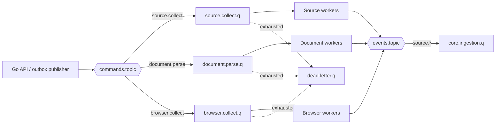

# Асинхронное взаимодействие и RabbitMQ

## 1. Назначение

RabbitMQ отделяет планирование расследования от медленного и нестабильного получения внешних данных. Брокер переносит команды и уведомления, но не хранит предметный результат. Долговременное состояние находится в PostgreSQL и MinIO.

Семантика доставки — `at least once`. Любое сообщение может быть доставлено повторно, поэтому обработчики обязаны быть идемпотентными.

## 2. Топология MVP



Exchanges:

- `commands.topic` — команды на выполнение работы;
- `events.topic` — сообщения о завершении и окончательной ошибке;
- `dead-letter.topic` — необрабатываемые сообщения.

Точные имена включают окружение через vhost, а не через случайные префиксы в routing key.

## 3. Каталог сообщений MVP

| Routing key | Назначение | Producer | Consumer |
|---|---|---|---|
| `source.collect.requested.v1` | получить данные источника | Go API | source worker |
| `document.parse.requested.v1` | разобрать сохранённый документ | Go API/source worker | document worker |
| `browser.collect.requested.v1` | выполнить браузерный сценарий | Go API | browser worker |
| `source.collect.completed.v1` | результат источника готов | worker | Go ingestion |
| `source.collect.failed.v1` | работа окончательно не выполнена | worker | Go orchestration |
| `document.parse.completed.v1` | производный материал готов | document worker | Go ingestion |

Событие `completed` означает техническое завершение, а не наличие совпадений.

## 4. Envelope

```json
{
  "message_id": "uuid",
  "message_type": "source.collect.requested",
  "schema_version": 1,
  "occurred_at": "2026-09-19T12:00:00Z",
  "correlation_id": "investigation-uuid",
  "causation_id": "http-command-or-message-uuid",
  "producer": "api",
  "payload": {}
}
```

Обязательные поля не помещаются только в RabbitMQ headers: сообщение должно оставаться самодостаточным при сохранении в DLQ. Headers могут дублировать `message_type`, trace context и retry count для маршрутизации.

### Формат сериализации

В MVP сообщения и HTTP API используют JSON:

- формат одинаково поддерживается Go, Python, TypeScript, RabbitMQ tooling и JSON Schema;
- сообщения остаются диагностируемыми стандартными средствами;
- крупные данные не пересылаются через брокер, а сохраняются manifest/объектом в MinIO;
- при доказанной необходимости применяется gzip для HTTP или сжатие manifest-файла.

## 5. Команда получения источника

Минимальная полезная нагрузка:

```json
{
  "job_id": "uuid",
  "investigation_id": "uuid",
  "source": "icij",
  "operation": "search_person",
  "query": {
    "names": ["Клебанов Александр Яковлевич", "Alexander Yakovlevich Klebanov"],
    "identifiers": [],
    "jurisdictions": ["KZ"]
  },
  "limits": {
    "max_records": 100,
    "deadline_at": "2026-09-19T12:05:00Z"
  }
}
```

Сообщение не содержит пароли, API keys и cookies. Worker получает секреты из конфигурации окружения/secret store по идентификатору источника.

## 6. Результат

Небольшой результат может содержать стандартизированные записи непосредственно. Для документа, Bulk-пакета или большого списка передаётся ссылка на manifest в MinIO:

```json
{
  "job_id": "uuid",
  "investigation_id": "uuid",
  "source": "icij",
  "outcome": "success",
  "records_count": 4,
  "artifact_ids": ["uuid"],
  "manifest": {
    "object_key": "ingestion/.../manifest.json",
    "sha256": "hex"
  },
  "adapter_version": "icij/0.1.0",
  "warnings": []
}
```

## 7. Подтверждение и идемпотентность

Consumer подтверждает (`ack`) сообщение только после того, как:

1. результат устойчиво сохранён;
2. исходящее событие записано в outbox или опубликовано с допустимым подтверждением;
3. `message_id` отмечен обработанным.

Повторная доставка проверяется по паре `consumer_name + message_id`. Бизнес-операция дополнительно защищается `job_id` и `idempotency_key`.

## 8. Повторы

Ошибки классифицируются:

- `transient` — timeout, временный 5xx, кратковременная недоступность;
- `rate_limited` — повтор после указанного или вычисленного интервала;
- `permanent` — неподдерживаемый формат, запрет доступа, невалидное задание;
- `action_required` — CAPTCHA, ручной документ, выбор пользователя;
- `bug` — нарушение контракта или необработанное исключение.

Повторы выполняются через retry queues с TTL или delayed exchange, если плагин доступен. Нельзя мгновенно переотправлять сообщение в ту же очередь. Рекомендуемые начальные интервалы: 30 секунд, 2 минуты, 10 минут с jitter; источник может переопределить их в допустимых пределах.

После исчерпания попыток сообщение попадает в DLQ, а `source_job` получает терминальное состояние. DLQ не переигрывается автоматически без анализа причины.

## 9. Порядок и параллельность

- Глобальный порядок сообщений не требуется.
- Результат может прийти после отмены расследования; он сохраняется как технический результат, но не расширяет отменённое расследование.
- Для источника задаётся отдельный concurrency и rate limiter.
- Prefetch выбирается по типу работы; browser worker имеет небольшой prefetch.
- Большой Bulk-импорт разбивается на части с детерминированными ключами.

## 10. Версионирование

Версия присутствует в routing key и envelope. Consumer поддерживает текущую и предыдущую версию на время совместимого релиза. Несовместимое сообщение не подтверждается как успешно обработанное и направляется в DLQ с понятной причиной.

## 11. Transactional outbox

Go API сохраняет изменение состояния и `outbox_messages` одной транзакцией. Отдельный publisher читает неопубликованные записи, отправляет их с publisher confirms и отмечает публикацию. Возможная повторная публикация безопасна благодаря `message_id`.

Для входящих результатов применяется inbox/`consumed_messages`. Распределённая транзакция PostgreSQL–RabbitMQ не используется.
