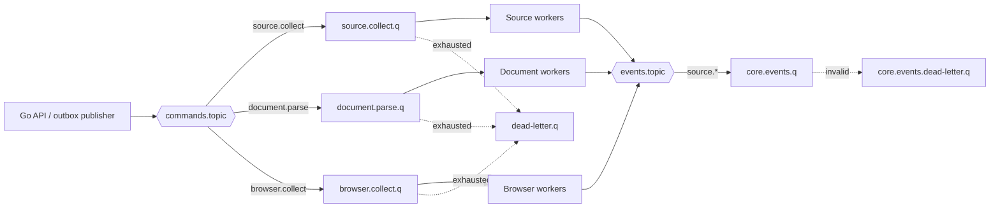

# Асинхронное взаимодействие и RabbitMQ

## 1. Назначение

RabbitMQ отделяет планирование расследования от медленного и нестабильного получения внешних данных. Брокер переносит команды и уведомления, но не хранит предметный результат. Долговременное состояние находится в PostgreSQL и MinIO.

Семантика доставки - `at least once`. Любое сообщение может быть доставлено повторно, поэтому обработчики обязаны быть идемпотентными.

## 2. Топология MVP


```mermaid
flowchart LR
    API[Go API / outbox publisher] --> C{{commands.topic}}
    C -->|source.collect| QS[source.collect.q]
    C -->|document.parse| QD[document.parse.q]
    C -->|browser.collect| QB[browser.collect.q]
    QS --> SW[Source workers]
    QD --> DW[Document workers]
    QB --> BW[Browser workers]
    SW --> E{{events.topic}}
    DW --> E
    BW --> E
    E -->|source.*| QC[core.events.q]
    QS -. exhausted .-> DLQ[dead-letter.q]
    QD -. exhausted .-> DLQ
    QB -. exhausted .-> DLQ
    QC -. invalid .-> EDQ[core.events.dead-letter.q]
```

Exchanges:

- `commands.topic` - команды на выполнение работы;
- `events.topic` - сообщения о завершении и окончательной ошибке;
- `dead-letter.topic` - необрабатываемые сообщения.

Точные имена включают окружение через vhost, а не через случайные префиксы в routing key.

## 3. Каталог сообщений MVP

| Routing key | Назначение | Producer | Consumer |
|---|---|---|---|
| `source.collect.requested.v1` | получить данные источника | Go outbox publisher | source worker |
| `source.collect.started.v1` | worker начал попытку | source worker | Go orchestration |
| `source.collect.retry_scheduled.v1` | запланирован повтор после временной ошибки | source worker runtime | Go orchestration |
| `document.parse.requested.v1` | разобрать сохранённый документ | Go API/source worker | document worker |
| `browser.collect.requested.v1` | выполнить браузерный сценарий | Go API | browser worker |
| `source.collect.completed.v1` | результат источника готов | worker | Go ingestion |
| `source.collect.failed.v1` | работа окончательно не выполнена | worker | Go orchestration |
| `document.parse.completed.v1` | производный материал готов | document worker | Go ingestion |

Событие `completed` означает техническое завершение, а не наличие совпадений.

`core.events.q` имеет один тип Go consumer - event router. Он валидирует envelope и schema, а затем передаёт событие orchestration или ingestion handler внутри одного приложения. Разные handlers не запускаются как конкурирующие consumers одной очереди. Contract-invalid worker event направляется в отдельную event DLQ.

## 4. Envelope

```json
{
  "message_id": "uuid",
  "message_type": "source.collect.requested",
  "schema_version": 1,
  "occurred_at": "2026-09-19T12:00:00Z",
  "correlation_id": "investigation-uuid",
  "causation_id": "http-command-or-message-uuid",
  "producer": "api",
  "root_command_id": "uuid",
  "payload": {}
}
```

Обязательные поля не помещаются только в RabbitMQ headers: сообщение должно оставаться самодостаточным при сохранении в DLQ. Headers могут дублировать `message_type`, trace context и retry count для маршрутизации.

### Формат сериализации

В MVP сообщения и HTTP API используют JSON:

- формат одинаково поддерживается Go, Python, TypeScript, RabbitMQ tooling и JSON Schema;
- сообщения остаются диагностируемыми стандартными средствами;
- крупные данные не пересылаются через брокер, а сохраняются manifest/объектом в MinIO;
- при доказанной необходимости применяется gzip для HTTP или сжатие manifest-файла.

## 5. Команда получения источника

Минимальная полезная нагрузка:

```json
{
  "job_id": "uuid",
  "attempt_no": 1,
  "attempt_id": "uuid",
  "investigation_id": "uuid",
  "source": "icij",
  "operation": "search_person",
  "purpose": "candidate_discovery",
  "query": {
    "names": ["Клебанов Александр Яковлевич", "Alexander Yakovlevich Klebanov"],
    "identifiers": [],
    "jurisdictions": ["KZ"]
  },
  "limits": {
    "max_records": 100,
    "deadline_at": "2026-09-19T12:05:00Z"
  }
}
```

Сообщение не содержит пароли, API keys и cookies. Worker получает секреты из конфигурации окружения/secret store по идентификатору источника.

Команда самодостаточна: worker не запрашивает `source_jobs` и не имеет доступа к PostgreSQL. Поле `source_jobs.request` и payload команды создаются из одной прикладной структуры в общей транзакции; outbox хранит транспортный снимок этой команды.

`purpose` объясняет место задания в расследовании (`candidate_discovery`, `enrichment`, `branch_expansion`, `document_processing`, `reprocessing`) и не меняет транспортную маршрутизацию само по себе. После решения initial-subject review Go API одной транзакцией создаёт enrichment jobs и соответствующий outbox; RabbitMQ не принимает решение о переходе между фазами.

## 6. Результат

Небольшой результат может содержать стандартизированные записи непосредственно. Для документа, Bulk-пакета или большого списка передаётся ссылка на manifest в MinIO:

```json
{
  "job_id": "uuid",
  "attempt_no": 1,
  "attempt_id": "uuid",
  "investigation_id": "uuid",
  "source": "icij",
  "outcome": "success",
  "records_count": 4,
  "artifact_ids": ["uuid"],
  "manifest": {
    "object_key": "ingestion/.../manifest.json",
    "sha256": "hex"
  },
  "adapter_version": "icij/0.1.0",
  "result_digest": "sha256-hex",
  "warnings": []
}
```

Terminal result дополнительно содержит `result_digest`: SHA-256 канонического небольшого результата либо содержимого manifest. В digest не входят transport-поля (`message_id`, `occurred_at`, trace context), поэтому повтор одной и той же бизнес-выдачи имеет тот же digest. Точный алгоритм canonical JSON и набор включённых полей фиксируются в JSON Schema и общей contract fixture до реализации consumer. Все события `started`, `retry_scheduled`, `completed` и `failed` содержат `job_id`, `attempt_no`, `attempt_id` и `root_command_id`.

## 7. Подтверждение и идемпотентность

Consumer подтверждает (`ack`) сообщение только после того, как:

1. результат устойчиво сохранён;
2. исходящее событие записано в outbox или опубликовано с допустимым подтверждением;
3. `message_id` отмечен обработанным.

Повторная доставка одной публикации проверяется по паре `consumer_name + message_id`. Этого недостаточно, потому что повтор команды может выпустить новый result message. Применение результата дополнительно защищается `(job_id, result_digest)`, а переход состояния - `job_id`, `attempt_no` и допустимой таблицей переходов. Терминальное состояние не понижается запоздалым событием.

## 8. Повторы

Ошибки классифицируются:

- `transient` - timeout, временный 5xx, кратковременная недоступность;
- `rate_limited` - повтор после указанного или вычисленного интервала;
- `permanent` - неподдерживаемый формат, запрет доступа, невалидное задание;
- `action_required` - CAPTCHA или ручное предоставление документа; выбор кандидата относится к `match_review`, а не к состоянию worker-команды;
- `bug` - нарушение контракта или необработанное исключение.

Повторы выполняются через retry queues с TTL или delayed exchange, если плагин доступен. Нельзя мгновенно переотправлять сообщение в ту же очередь. Рекомендуемые начальные интервалы: 30 секунд, 2 минуты, 10 минут с jitter; источник может переопределить их в допустимых пределах.

Перед помещением команды в retry queue runtime публикует `source.collect.retry_scheduled.v1` с номером завершившейся попытки и `next_retry_at`, затем с publisher confirm публикует retry-команду с тем же `job_id`, новым `message_id`, неизменным `root_command_id` и увеличенным `attempt_no`. Только после подтверждения обеих необходимых публикаций исходная delivery подтверждается worker. При следующем получении worker публикует `started` для нового attempt. Эти события позволяют Go-контуру поддерживать состояние интерфейса, не превращая PostgreSQL в планировщик повторов.

После исчерпания технических попыток runtime публикует терминальный `failed` event с publisher confirm и подтверждает исходную команду. Poison/contract-invalid команда отвергается в command DLQ. DLQ сама по себе не меняет `source_job`: терминальное business state всегда задаётся валидным event либо явным операторским действием. DLQ не переигрывается автоматически без анализа причины.

## 9. Порядок и параллельность

- Глобальный порядок сообщений не требуется.
- Результат может прийти после отмены расследования; artifact/receipt допускается сохранить с `applied = false`, но status не меняется и результат не расширяет отменённое расследование.
- Для источника задаётся отдельный concurrency и rate limiter.
- Prefetch выбирается по типу работы; browser worker имеет небольшой prefetch.
- Большой Bulk-импорт разбивается на части с детерминированными ключами.

## 10. Версионирование

Версия присутствует в routing key и envelope. Consumer поддерживает текущую и предыдущую версию только в явно объявленный период совместимости. Несовместимое сообщение не подтверждается как успешно обработанное и направляется в event DLQ с безопасной причиной.

## 11. Transactional outbox

Go API сохраняет изменение состояния и `outbox_messages` одной транзакцией. Отдельный publisher читает неопубликованные записи, отправляет их с publisher confirms и отмечает публикацию. Возможная повторная публикация безопасна благодаря `message_id`.

Publisher читает `outbox_messages`, а не `source_jobs`. После подтверждения RabbitMQ он в одной транзакции отмечает outbox опубликованным и переводит связанный job из `pending` в `queued`, если тот ещё находится в ожидаемом состоянии.

Для входящих результатов применяется inbox/`consumed_messages`. Распределённая транзакция PostgreSQL–RabbitMQ не используется.

## 12. Обязательные сценарии отказа

До подключения реального источника интеграционные тесты воспроизводят:

1. повтор command delivery;
2. crash worker после confirmed result publish, но до command ack;
3. два result messages с разными `message_id` и одинаковым digest;
4. поздний `started` после `completed`;
5. поздний результат после cancellation;
6. contract-invalid command и contract-invalid event в соответствующих DLQ;
7. отказ outbox publisher после RabbitMQ confirm, но до фиксации `published_at`.
