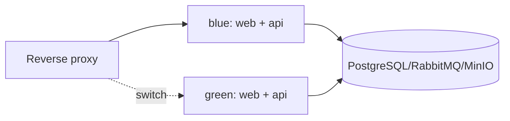

# Развёртывание и эксплуатация

## 1. Окружения

- `local` — разработка через Docker Compose;
- `ci` — изолированный контур тестов;
- `demo` — единый VPS для демонстрации MVP.

Отдельное production-окружение появляется только после решения продолжать проект.

## 2. Контейнеры MVP

```text
web
api
source-worker
document-worker
browser-worker       # запускается только при наличии браузерного источника
postgres
rabbitmq
minio
reverse-proxy
```

`source-worker`, `document-worker` и `browser-worker` собираются из одного Python image с разными entrypoint/queue binding. Это не отдельные кодовые базы.

В роли reverse proxy принят Nginx. Он завершает TLS, применяет временную защиту demo, отдаёт статические файлы Vue, проксирует `/api` и переключает upstream между blue и green.

## 3. Конфигурация

- Конфигурация читается из переменных окружения по правилам [документа конфигурации](16-configuration.md).
- `.env.example` содержит только имена и безопасные примеры.
- Секреты не коммитятся и не попадают в Docker image.
- Для каждого окружения используются отдельные RabbitMQ vhost, PostgreSQL database и MinIO bucket/prefix.
- Feature flags включают нестабильные источники без изменения кода.

## 4. Health checks

### API

- `/health/live` — процесс работает;
- `/health/ready` — доступны обязательные зависимости для приёма запросов.

### Workers

Процесс предоставляет container healthcheck на основе heartbeat/локального probe. FastAPI ради одного health endpoint не обязателен. Readiness учитывает RabbitMQ и конфигурацию, но краткая недоступность внешнего источника не делает весь worker unready.

## 5. GitHub Actions

Рекомендуемый pipeline:

1. lint и unit tests;
2. contract/integration tests;
3. сборка immutable images;
4. маркировка commit SHA;
5. доставка образов в registry;
6. миграция расширяющего типа;
7. запуск green stack;
8. smoke/readiness checks;
9. переключение reverse proxy;
10. наблюдение и остановка blue stack.

Развёртывание выполняется только из защищённой ветки или вручную подтверждённого workflow.

## 6. Blue-green



В MVP blue-green применяется прежде всего к stateless web/API. Одновременный запуск workers двух версий разрешён только при совместимых сообщениях и идемпотентности.

Порядок:

1. создать резервную копию, если миграция затрагивает данные;
2. применить обратно совместимую расширяющую миграцию;
3. поднять green;
4. проверить health и сквозной smoke;
5. переключить трафик;
6. выдержать период наблюдения;
7. остановить blue;
8. удаляющую миграцию выполнять отдельным будущим релизом.

Docker Compose сам по себе не переключает трафик: это делают Nginx и deploy script/workflow.

## 7. Миграции БД

- Запускаются отдельным job, а не каждым API instance.
- Необратимая миграция требует плана восстановления.
- Rename выполняется через добавление нового поля, двойное чтение/запись при необходимости и последующее удаление.
- Новая версия приложения должна работать со схемой в переходном состоянии.
- Миграции тестируются с предыдущей версией БД.

## 8. Резервное копирование

До внешней демонстрации обязательны:

- регулярный PostgreSQL dump и проверка восстановления;
- versioning или backup критичных MinIO buckets;
- экспорт конфигурации RabbitMQ, но не попытка сохранять очередь как предметную БД;
- документированный RPO/RTO хотя бы на уровне demo.

Необработанные команды восстанавливаются из `source_jobs`/outbox при необходимости.

## 9. Откат

- Приложение откатывается переключением reverse proxy на blue.
- Схема БД остаётся обратно совместимой.
- Consumer старой версии запускается только если понимает активные версии сообщений.
- Нельзя автоматически переигрывать DLQ как способ отката.

## 10. Ресурсы

Browser worker имеет отдельные лимиты CPU/RAM. Bulk и PDF-задачи ограничивают размер, время и параллельность. PostgreSQL, MinIO и RabbitMQ получают постоянные volumes; пути volumes проверяются до любых операций удаления или переноса.
